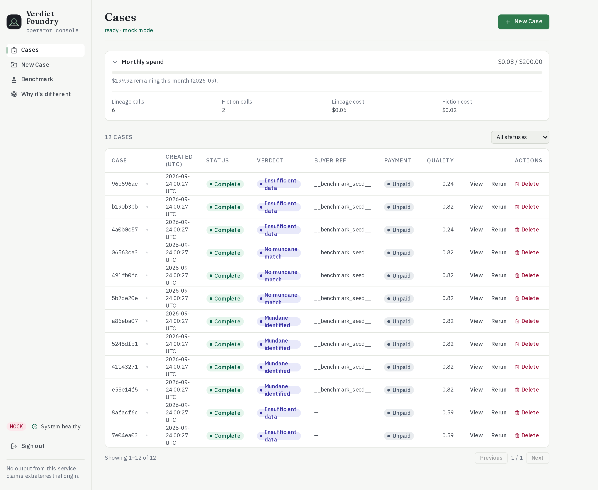
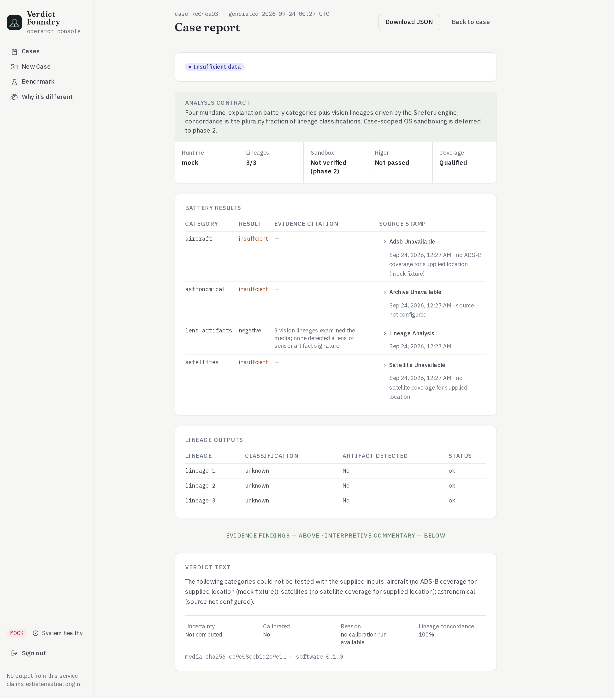
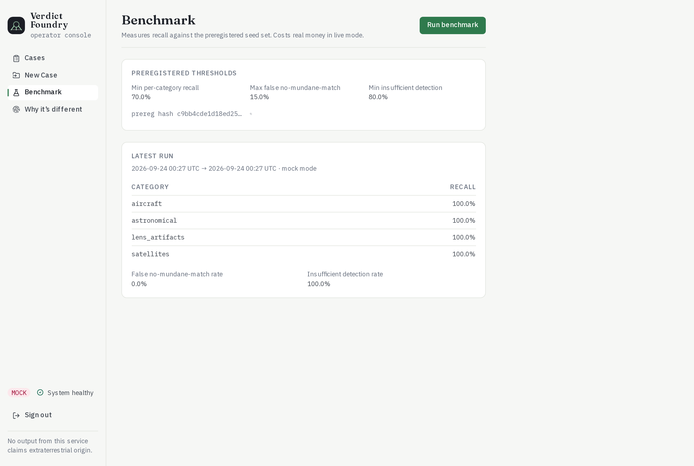

<div align="center">


**Forensic verdicts for unexplained aerial footage: tested against mundane explanations, never sensationalised.**

A one-operator service. A photo or video comes in, and a defensible three-state verdict goes out. The verdict comes with evidence citations, source stamps, calibrated uncertainty and a hash-chained audit log. **No output of this system asserts extraterrestrial origin. Even if it is.** Templated verdict text and an export linter enforce that mechanically. 

The operator's seed made this an `sdk` product. A running Sneferu engine sits behind it, and the product uses it for multi-model judging instead of reimplementing any of that. UAPVF talks to the engine over HTTP using the SDK's wire contract. Sneferu Instances will be availible soon. 




</div>

---

## Three verdicts, and what each one means

| Verdict | Meaning |
|---|---|
| `mundane_identified` | a configured mundane explanation matched the capture's time, place and viewing direction |
| `no_mundane_match` | *every* tested category had coverage, and none matched |
| `insufficient_data` | at least one category **couldn't be tested** with the inputs supplied |

The rule is deliberately conservative. Any positive match gives `mundane_identified`. Otherwise, any untestable category gives `insufficient_data`. Only when every category is covered and negative does the case reach `no_mundane_match`. Missing coverage is always reported as *insufficient*, never as an invented negative. The verdict wording comes from templates and is never model-generated.

## What runs on every case

Ten stages run in order:

1. intake
2. quality gate
3. lineage analysis
4. rigor adjudication
5. mundane-explanation battery
6. coverage check
7. verdict
8. uncertainty
9. report render and lint
10. a text-only *fiction seed* for unresolved cases, labelled `[SPECULATIVE FICTION — NOT FORENSIC EVIDENCE]` on every paragraph

Media decoding at intake runs in a one-shot OS sandbox scoped to the case, with no network. The battery tests four categories: **aircraft** (ADS-B), **satellites** (TLE/OMM), **lens artifacts** and **astronomical** (a catalog archive). A lineage that names a mundane class the battery doesn't test (drones, birds, balloons) forces `insufficient_data`, rather than letting that class slip through as unexplained.

<div align="center">

<br><sub>A case report. Each category shows its result, its evidence and where the data came from. The verdict text names exactly what couldn't be tested and why.</sub>
</div>

## Calibrated before it's trusted

The thresholds are **preregistered**, and their hash is recorded before any run. A benchmark then puts ten labelled seed cases through the real pipeline and reports recall per category. In live mode, those results calibrate the uncertainty attached to each verdict.

<div align="center">

<br><sub>This run used mock mode, with deterministic fixtures and no spend. The 100% figures prove the harness works end to end. They are not an accuracy claim.</sub>
</div>

## Run it

```bash
python3 -m venv .venv && source .venv/bin/activate
python3 -m pip install -r requirements.lock && python3 -m pip install -e .
cp .env.example .env            # set UAPV_OPERATOR_TOKEN (blank by default, so nothing can sign in until you do)
uapvf db init
uapvf serve                     # http://127.0.0.1:8470 (mock mode by default)

export UAPV_CLI_TOKEN="<your operator token>"
uapvf case submit --media tests/fixtures/unexplained.jpg --fields tests/fixtures/fields.json
uapvf case export <case_id> --out ~/uapvf-out
uapvf benchmark run
```

Video needs `ffmpeg` and `ffprobe` on your PATH. Build the React console with `cd ui && npm install && npm run build`; the server-rendered screens work without it. For production, [`deploy/`](deploy/) has a hardened systemd and Caddy profile. The guides are in [`docs/`](docs/): the user guide, architecture, API, UI, operations and a runbook.

## Built on Sneferu

The operator's seed made this an `sdk` product. A running Sneferu engine sits behind it, and the product uses it for multi-model judging instead of reimplementing any of that. UAPVF talks to the engine over HTTP using the SDK's wire contract. It doesn't import the `claudopus` client.

| Live-mode call | Sneferu route | Today, on the real engine |
|---|---|---|
| Readiness probe | `POST /sdk/judge` with `mock: true` | works |
| Xenoscience: 7 bounded speculative claims, each judged separately, majority agreement | `POST /sdk/judge` | works; mock, degraded and single-lineage answers are refused as not production |
| Vision lineage analysis (FR-005) | `POST /sdk/uapvf/lineages` | missing: the route returns 404 |
| Fiction text (FR-011) | `POST /sdk/uapvf/fiction` | missing: the route returns 404 |

**Checked against a real Sneferu engine (2026-09-23).** UAPVF's own adapter functions were called against a Sneferu server built from its own source (checkout `07174496`):

- **Readiness:** the probe passed.
- **Xenoscience:** the engine accepted every judge request. It refused the mock-mode answers as mock and the no-model-keys answers as degraded, which is exactly what the adapter should do.

The two UAPVF-specific routes returned 404. The build flagged them itself (assumption A-013: the engine's conformance is unverified). Vision analysis sends an image, and the public SDK's `judge` takes text, so live lineage analysis needs engine-side work: a route or a generated workflow in Sneferu. Mock mode needs no engine.

**Not yet exercised:** any call with live models behind it.

## Tests

```bash
python3 -m pytest tests/ -q     # 426 passed, 26 skipped
cd ui && npm test -- --run      # 24 passed (Vitest)
```

Both suites were run while preparing this repository, along with a live mock-mode session: two cases submitted, the benchmark run, and every console screen opened in Chromium. The **26 skipped tests** describe behaviour that a later build round removed or deferred to phase 2, as listed below. Each one carries that reason in its skip marker. Before, they were failing tests that the project's own CI would have run.

## Status, honestly

- **Mock mode is the complete path today.** In live mode, readiness and xenoscience judging reach the real engine. Lineage analysis and fiction wait on the two engine routes above.
- **Deferred to phase 2**, as the build itself documents:
  - buyer-facing delivery (the operator exports and sends reports by hand)
  - local lineage execution and model-weight certification
  - the canon graph
  - automatic retention
  - independent restore-verification of scrubbed backups
  - strict controlling-reference gating
- **Fixed while preparing this repository:**
  - Every live xenoscience judgment would have failed: the request sent `context` as an object, and the engine's `JudgeRequest` takes a string, so it answered 422. It's now sent as a JSON string, and a test checks each field against the engine's contract (and against the SDK's own `JudgeRequest` model when it's installed).
  - `.env.example` shipped `UAPV_OPERATOR_TOKEN=UAPV_OPERATOR_TOKEN`, so anyone who copied it had a guessable login. It's now blank, and a blank token refuses every sign-in.
  - The operator config and benchmark seeds in `var/` are included.
- This is a single-operator product with proprietary licensing (see `pyproject.toml`).

## How it was made

**Sneferu's business pipeline** built UAP Verdict Foundry as run `2026-08-19T22-47-43Z-pipeline-f7863d20`. It covered:

- the commercial case for a one-person forensic-analysis bureau
- a product contract whose hard boundary is *never claim extraterrestrial origin*
- a design soul (`SOUL.md`: *"Density over breath. Honesty over politeness. Flat facts at 6:40am."*)
- a cooperative build over several rounds between independent coder and reviewer models

The later rounds show up in the code. The build cut a third "simulation" mode because it had been quietly spending live-engine money under a simulation label, and selecting that mode now fails closed with a named error.

<div align="center">

---

**Built by [Sneferu](https://sneferu.ai)**

<sub>README by Claude (Anthropic). The screenshots show mock mode with deterministic fixtures.</sub>

</div>
