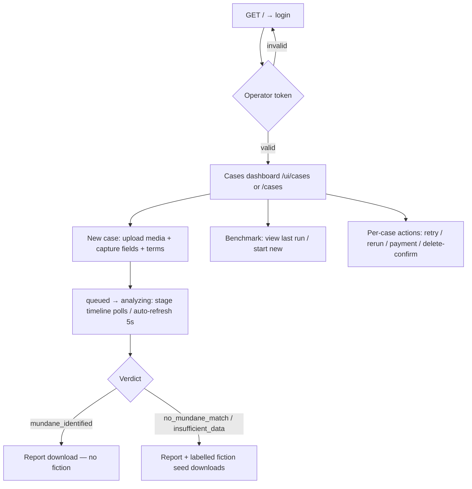

# UAP Verdict Foundry — UI Reference

The product ships **two UI surfaces** from the same backend:

1. **The React operator console** under `/ui/*` — canonical when built
   (`ui/dist`). React 19 + react-router 7 + TanStack Query + Tailwind CSS 4,
   bundled by Vite 7 with `base: "/ui/"`.
2. **Server-rendered HTML screens** under `/cases*`, `/login`, `/terms`,
   `/benchmark` — zero-JavaScript (auto-refresh via
   `<meta http-equiv="refresh" content="5">`), fully functional without any
   build step. They also serve as the curl-visible surfaces and the fallback
   when `ui/dist` is absent.

Both speak to the same routes; the console sends `Accept: application/json`
on them (content negotiation, `web_json.wants_json`). See
[API.md](API.md) §1.

## 1. SPA screens (`ui/src/pages/`)

Route table (`ui/src/App.tsx`); every authenticated screen renders inside
the `Layout` sidebar shell:

| Route | Screen | Purpose |
|---|---|---|
| `/ui/login` | `LoginPage` | Token entry. `AuthContext` shows it when the bootstrap/`/cases` probe says unauthenticated. Submit → `POST /login` (JSON dialect) → cookie set → redirect `/ui/cases`. Error state: “Invalid operator token.” on code `auth_failed`. |
| `/ui/terms` | `TermsPage` | Full terms text via `GET /terms` JSON dialect. Linked from login and intake. |
| `/ui/cases` | `CasesDashboardPage` | Case list with `status` filter + pagination (limit/offset). Rows: short id, created time, status pill, verdict, buyer ref, payment badge, retention-exceeded flag. Spend summary + estimated per-case cost + benchmark-cost estimate from the JSON payload. Empty state: “No cases yet” with a link to `/ui/cases/new`. |
| `/ui/cases/new` | `NewCasePage` | Intake form: image/video, capture geometry and weather, buyer/payment fields, and terms. Server config declares a three-lineage estimate (B13 slice) and media caps (50 MB/20 MP image · 250 MB/60 s video). |
| `/ui/cases/:caseId` | `CaseDetailPage` | Ten-stage timeline (FR-004 stage order); lineage contract; OS-sandbox, rigor, and four-category battery coverage status; evidence tables; permanent evidence/interpretation divider; reports, payment, and audit. Round 4 removed the phase-2 surfaces: no labelled story plate, no buyer-link creation/revocation (the MVP delivers reports manually, spec §1 OUT). |
| `/ui/cases/:caseId/delete/confirm` | `DeleteConfirmPage` | Two-step confirmation (spec: destructive actions need an explicit second screen) with `ConfirmDialog`; `POST /cases/:id/delete` JSON dialect; `analyzing` cases → `409 conflict` surfaced as a toast. |
| `/ui/cases/:caseId/report` | `ReportPage` | The rendered report. Evidence/interpretation boundary is honoured by the server-rendered `report.html` sections (`data-section="disclaimer|evidence|interpretation"`). |
| `/ui/cases/:caseId/fiction` | `FictionPage` | Shows the fiction seed with its permanent non-evidence label; `404` states (mundane verdict / withheld / none) are surfaced, not hidden. |
| `/ui/benchmark` | `BenchmarkPage` | Latest benchmark run (recall per category, false-no-mundane-match rate, insufficient-detection rate, pass/fail, prereg hash), estimated benchmark cost, Run button → `POST /benchmark/run` JSON dialect (`202` + progress polling). |
| `/ui/why` | `WhyPage` | Current, cited overlap matrix and the combination-level product differentiator. |
| `*` | `NotFoundPage` | Unknown route. |

Supporting components (`ui/src/components/`, `ui/src/auth/`): `Layout`
(sidebar navigation), `ConfirmDialog`, `EvidenceDivider`,
`SourceStampDisplay`, `SystemStatusPopover` (mode + readiness summary),
`PollingPolicy` helpers, `AuthContext` (bootstrap read + session probe +
logout), `BootstrapContext` (server-injected startup payload).

### SPA ↔ backend contract (`ui/src/lib/api.ts`, `web_json.py`)

- Every request: `Accept: application/json`, `credentials: "include"`,
  `redirect: "error"` (a server-side redirect never leaks a fetch).
- Error classification is by the **typed `code` field**, never message
  substrings. Codes → UI behavior: `auth_failed` → login error;
  `auth_expired` → forced re-login; `csrf_expired` → reload the page
  (fresh CSRF token via bootstrap); `spend_cap_reached` → inline cap
  notice; `validation_error` → per-field messages from `errors[]`;
  `file_too_large` / `unsupported_type` / `rate_limited` /
  `insufficient_storage` → dedicated intake notices; `conflict` → toast.
- On boot, the backend injects `<script id="uapv-bootstrap">` into
  `ui/dist/index.html` with `{"authenticated": bool, "csrf_token": string|null,
  "mode": "mock|live"}` (escaping `<` as `\u003c`); the app never boots blind.
- Mutating requests include `X-CSRF-Token` from the bootstrap/session.
- The SPA dev server proxies API paths to the backend (see §4); in dev only,
  CSRF is disabled on loopback because the proxy cannot carry session cookies
  (accepted gap, SPEC §12.4).

## 2. Server-rendered screens (also the no-JavaScript fallback)

| Screen | Route | Notes |
|---|---|---|
| Login | `GET/POST /login` | Single password field; 401 with error on wrong token; 303 → `/cases` on success. |
| Terms | `GET /terms` | Public; six clauses. |
| New case (S1) | `GET/POST /cases/new` | Multipart form; three-lineage upper-bound estimate; CSRF hidden input. |
| Case list (S2) | `GET /cases` | Filter by `status`, pagination `limit`/`offset`, retention badge, per-row retry/rerun/delete. |
| Case detail (S3) | `GET /cases/{id}` | Status badge, verdict + text, downloads, payment form, stage table, battery table, last 25 audit events; meta-refresh every 5 s while non-terminal. |
| Delete confirm (S4) | `GET /cases/{id}/delete/confirm` | Confirmation page before the destructive POST. |
| Report (S5) | `GET /cases/{id}/report` | Attachment download (HTML) — or JSON content under `Accept: application/json`. |
| Fiction (S6) | `GET /cases/{id}/fiction` | `text/markdown` attachment; 404 when mundane/withheld/absent. |
| Benchmark (S7) | `GET/POST /benchmark` | Latest run or “Processing seed case X of Y…” during a run, meta-refresh; form POST starts a run. |
| Spend | (JSON only) | `GET /api/v1/spend` — the web surfaces embed the same summary in `/cases` JSON payloads. |
| Root | `GET /` | Redirects into the SPA (`/ui/login` or `/ui/cases`) when built; to `/login` or `/cases` otherwise. |

## 3. Primary user flows



## 4. Local development of the console

```bash
cd ui
npm install
npm run dev        # Vite dev server on http://localhost:5173
```

`ui/vite.config.ts` proxies the API paths (`/login`, `/logout`, `/terms`,
`/cases`, `/cases/new`, `/cases/:caseId` incl. `report|fiction|retry|rerun|
payment|delete`, `/benchmark`, `/benchmark/run`, `/healthz`, `/readyz`) to
`http://127.0.0.1:8470` — run `uapvf serve` first. CSRF is disabled on
loopback in dev because the proxy cannot forward session cookies (SPEC
§12.4 accepted gap).

Build for production:

```bash
cd ui
npm run build      # tsc typecheck + Vite build → ui/dist (base /ui/)
npm test           # vitest (jsdom)
npm run lint       # eslint src
```

`ui/dist` is gitignored. **After building, restart `uapvf serve`**: the
`/ui/assets` static mount and brand-mark routes are registered at startup;
a server started before the build keeps answering 503 “UI not built” until
restarted (the shell route itself reads `index.html` per request).

## 5. States inventory

| State | Where | Behavior |
|---|---|---|
| Loading | SPA queries | TanStack Query pending states; detail page polls on the polling policy while non-terminal. |
| Empty dashboard | `/ui/cases`, `/cases` | “No cases yet” + new-case link. |
| Unauthenticated | any SPA route | `ProtectedRoute` → `/ui/login`; HTML screens → 302 `/login`. |
| Session expired | SPA fetch | code `auth_expired` → login redirect with message. |
| Wrong token | `/ui/login`, `/login` | 401 inline error, no redirect. |
| UI not built | `/ui/*` | 503 text: “UI not built — run 'npm run build' in ui/”; all scaffold screens keep working. |
| Report not ready | report routes | `409` (non-ready status) rendered as “report not yet available”; during `rerun_requested` the archived report is served. |
| No fiction | fiction routes | `404` with reason — mundane verdict, label-cleared, or still processing. |
| Rate limited / spend capped | intake | `429 rate_limited` / spend-capped case row instead of rejection. |
| Benchmark running | `/benchmark`, SPA | “Processing seed case X of Y…” (meta-refresh on HTML; progress polling on SPA); second run → `409 conflict`. |

## 6. Design system

`DESIGN.md` is the source of truth: a dark-charcoal “foundry console”
(reference: Linear) — hairline rules instead of shadows, muted-tint status
pills, exact row heights, 2 px active rail, transform/opacity-only motion.
Typography: Fraunces (display) + IBM Plex Sans/Mono (self-hosted woff2,
bundled by the build). Brand marks ship in `BRAND_ASSETS/` and
`ui/dist/brand-mark.svg`; palette and voice live in `BRAND_IDENTITY.md` /
`SOUL.md`. SPA tokens: `ui/src/styles/tokens.css`.
