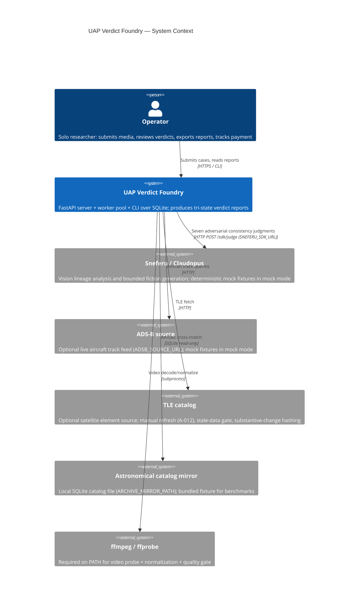
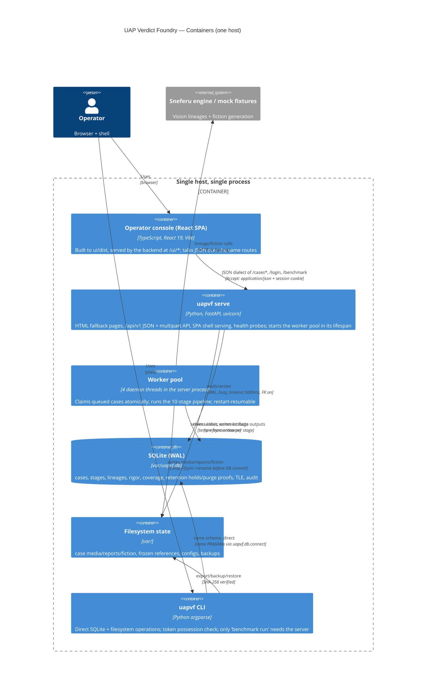
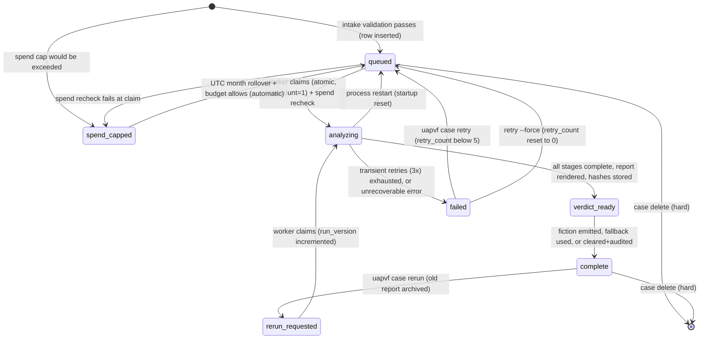
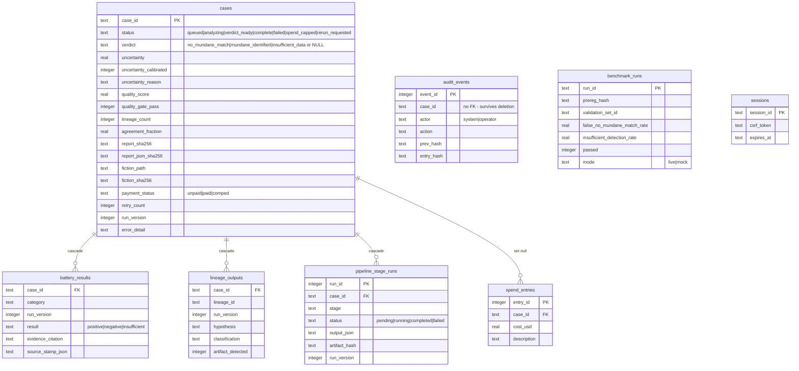

# UAP Verdict Foundry — Architecture

Version 0.1.0. This document describes the system that actually ships in
`src/uapvf/` and `ui/`, verified against the source and the test suite
(`tests/`, 256 tests). For day-to-day operation see
[OPERATIONS.md](OPERATIONS.md) and [runbook.md](runbook.md); for every route
and command see [API.md](API.md); for the screens see [UI.md](UI.md).

## 1. Project shape

A **single-operator, single-process service** with four faces over one shared
state store:

1. An **HTTP API + web server** (FastAPI, `src/uapvf/server.py`) that serves
   a React operator console under `/ui/*`, server-rendered HTML fallback
   pages under `/cases*`, a multipart+JSON intake/list/download API under
   `/api/v1/*`, and liveness/readiness probes.
2. An **embedded background worker pool** (4 daemon threads inside the same
   process, `src/uapvf/pipeline.py::WorkerPool`) that claims queued cases and
   drives them through an eight-stage analysis pipeline.
3. An **operator CLI** (`uapvf`, `src/uapvf/cli.py`) that operates directly on
   the same SQLite database and filesystem — most commands do not proxy
   through the server at all.
4. A **benchmark/calibration harness** (`src/uapvf/benchmark.py`) that runs
   ten labelled seed cases through the real pipeline and writes the
   calibration table used for uncertainty quantification.

There is no separate queue, no separate worker container, no external
database. State is SQLite (`var/uapvf.db`, WAL mode) plus per-case files
(`var/cases/<case_id>/`).

**What the product does:** accepts one UAP photo/video with capture time and
place, submits lineage analysis to the Sneferu orchestration engine
(FR-005, at least two vision lineages per case; local lineage execution is
deferred to phase 2), runs the four-category FR-006 mundane-explanation
battery (aircraft, satellites, lens/sensor artifacts, astronomical
objects), and produces a provenance-stamped report with a tri-state
verdict:

| Verdict | Meaning |
|---|---|
| `mundane_identified` | at least one battery category matched with cited evidence |
| `insufficient_data` | at least one category could not be tested on the supplied inputs |
| `no_mundane_match` | every configured category was tested and none matched |

No output of this system asserts extraterrestrial origin; the report linter
mechanically enforces that (see §8).

## 2. C4 — Context



Optional evidence sources return `insufficient` with a sentinel source stamp
when unavailable; they never invent a negative result (spec assumption A-006).
Claudopus is different: strict live promotion requires it and rejects mock,
degraded, or single-lineage judgments. An operator may explicitly set
`UAPV_REQUIRE_SNEFERU=0` to retain a visibly descoped local fallback. Mock mode
(`SNEFERU_MOCK=1`) is test-only and needs no network at all.

## 3. C4 — Container



Key property: **the CLI and the server are peers over the same store.**
`uapvf case submit` validates and inserts the row itself; the server's worker
pool picks it up. Only `uapvf benchmark run` and `uapvf serve` require the
HTTP server to be running.

## 4. C4 — Component (Python package)

```mermaid
C4Component
    title uapvf package — components (src/uapvf/)
    Container_Boundary(pkg, "uapvf") {
        Component(cli, "cli.py", "argparse CLI", "serve, db init, case *, benchmark *, audit *, spend, backup, restore, version")
        Component(server, "server.py", "FastAPI app factory", "Routes S1-S12 + /api/v1 + /ui/* serving + lifespan (DB init, startup reconcile, worker pool)")
        Component(webjson, "web_json.py", "JSON layer", "Accept negotiation, typed error codes, SPA payloads, CSP + bootstrap injection")
        Component(pipeline, "pipeline.py", "Orchestrator", "WorkerPool, 12 stages, atomic claim, retry taxonomy, resume, rerun, delete, payment")
        Component(intake, "intake.py", "Intake gauntlet", "Magic-byte MIME, size caps, decodability, fields validation, warnings, rate limit, normalization")
        Component(qgate, "quality_gate.py", "Quality scoring", "Resolution/compression/EXIF (image) or resolution/fps/bitrate (video) vs var/quality_config.json")
        Component(battery, "battery.py", "Battery engine", "Runs configured categories; sentinel stamps; BatteryConfigError is unrecoverable")
        Component(adapters, "adapters/", "Category adapters", "adsb, satellite, lineage, archive + battery_config_loader (${ENV} substitution) + geo.py")
        Component(snef, "adapters/sneferu_adapter.py", "Engine bridge", "Mock fixtures + mock hooks + mock_call_log.jsonl; live HTTP to SNEFERU_SDK_URL")
        Component(verdict, "verdict.py", "Verdict + uncertainty", "Tri-state rule + uncovered-classification amendment; FR-008 confidence; live-only calibration")
        Component(render, "render/", "Report rendering", "html_render (data-section layout), report_json sidecar, fiction (quarantined), linter (no-claims law)")
        Component(audit, "audit.py", "Hash chain", "Append-only sha256 chain, GENESIS root, verify_chain with fork-point detection")
        Component(spend, "spend.py", "Spend ledger", "Per-call entries, monthly cap check, benchmark exemption")
        Component(bench, "benchmark.py", "Calibration", "Prereg hash, seed manifest, metrics, 10-bin calibration.json")
        Component(db, "db.py", "Storage", "Schema, PRAGMAs per connection, seed_default_configs from packaged defaults/")
        Component(auth, "auth.py", "Sessions", "HMAC cookies, 256-bit session/CSRF, bearer check, 12h TTL")
    }
    ContainerDb(sqlite, "SQLite var/uapvf.db", "", "")
    Container(fs, "var/ filesystem", "", "")
    Rel(cli, pipeline, "retry/rerun/delete/set-payment")
    Rel(cli, db, "connect")
    Rel(server, webjson, "all negotiated routes")
    Rel(server, auth, "session/bearer checks")
    Rel(server, intake, "POST /cases/new, /api/v1/cases")
    Rel(server, bench, "POST /benchmark/run")
    Rel(pipeline, qgate, "stage 2")
    Rel(pipeline, snef, "stage 3 + stage 8")
    Rel(pipeline, battery, "stage 4")
    Rel(pipeline, verdict, "stages 5-6")
    Rel(pipeline, render, "stages 7-8")
    Rel(pipeline, audit, "every transition")
    Rel(pipeline, spend, "per SDK call")
    Rel(battery, adapters, "per category")
    Rel(intake, db, "insert cases row")
    Rel(pipeline, sqlite, "stage commits")
    Rel(pipeline, fs, "artifacts")
```



## 5. Primary flow — submission to export

```mermaid
sequenceDiagram
    autonumber
    participant Op as Operator (browser/CLI)
    participant Srv as FastAPI server
    participant Int as intake.py
    participant WP as Worker pool thread
    participant Ad as Sandboxed analysis + evidence adapters
    participant DB as SQLite + var/cases/
    Op->>Srv: POST /cases/new (multipart + CSRF) or uapvf case submit
    Srv->>Int: create_case(media, fields)
    Int->>Int: magic bytes + byte caps (no decoder)
    Int->>Int: fields validation, null-island/duration warnings, rate limit, spend precheck
    Int->>Int: case-only OS sandbox: decode/probe/normalize/quality score; network denied
    Int->>DB: sanitized media (temp->fsync->rename), INSERT cases (status=queued)
    Srv-->>Op: 303 /cases/{id} (web) · 202 {case_id,status} (API) · JSON (CLI)
    loop every UAPV_WORKER_POLL_S (0.2s)
        WP->>DB: SELECT oldest queued/rerun_requested; UPDATE...WHERE status='queued' (atomic claim, rowcount must be 1)
    end
    WP->>DB: stages 1-2 intake + quality_gate (score vs 0.35 floor)
    WP->>Ad: stage 3 lineage_analysis (7 isolated lineages; honest abstention allowed)
    WP->>Ad: rigor adjudication + 11-category battery + coverage gate
    Ad-->>WP: positive/negative/insufficient + evidence + source stamp per category
    WP->>DB: persist battery_results + lineage_outputs
    WP->>WP: verdict rule + calibrated uncertainty
    WP->>DB: report.html + report.json (size caps, export linter) -> status verdict_ready
    WP->>DB: permanently labelled text-only fiction seed (unresolved cases only) -> status complete
    Op->>Srv: GET /cases/{id}/report · uapvf case export --out DIR
    Srv-->>Op: report.html + report.json (+ fiction) with SHA-256 verification
```

Each stage's `output_json` + artifact hash commit to `pipeline_stage_runs`
in one SQLite transaction; filesystem artifacts are written **temp →
fsync → rename before the commit** (`pipeline.py::_write_artifact`). On
restart, `analyzing` cases reset to `queued` and resume from committed
stages filtered by `run_version`; corrupt stage outputs are audit-logged
(`stage_resume_corrupt`) and re-executed.

## 6. Case lifecycle state machine



Semantics worth knowing (all in `pipeline.py`):

- **retry** resumes from the last completed stage at the *same*
  `run_version`; completed stages are not re-executed.
- **rerun** archives the report as `report_<id>_v<N>.html`, deletes the old
  run's `battery_results`/`lineage_outputs`, bumps `run_version`, audits
  `verdict_superseded`, and re-executes everything against current data.
  The archived report stays downloadable during `rerun_requested`
  (`server.py::_serve_report`).
- **delete** is a hard delete: cascading rows, `var/cases/<id>/` removed;
  `spend_entries.case_id` set NULL; `audit_events` survive (no FK by
  design — the exported report is the durable forensic record).

## 7. Data model



Durable-state rules (`db.py`, spec §5):

- Every connection sets `PRAGMA journal_mode=WAL`, `busy_timeout=5000`,
  `foreign_keys=ON` (`db.connect`).
- `uapvf db init` is idempotent and also seeds missing operator config
  templates from the packaged `uapvf/defaults/` — so a wheel install with no
  repo `var/` tree still gets `battery_config.yaml`, `quality_config.json`,
  the fiction template/constraints, and `mock_fixtures.json`
  (`db.seed_default_configs`, never overwrites existing files).
- `audit_events` is an append-only hash chain:
  `entry_hash = sha256(case_id || "||" || actor || "||" || action || "||" ||
  canonical_detail_json || "||" || prev_hash || "||" || recorded_at)`,
  first entry's `prev_hash = "GENESIS"`. `uapvf audit verify --all`
  recomputes it; `restore` appends a `restore_genesis` continuation entry
  whose `prev_hash` re-links to the old chain tail, so the chain stays
  verifiable end to end after a restore.
- There is **no `deleted_at` column** — deletion is hard by design.

## 8. Key design decisions

| Decision | Rationale (as built) |
|---|---|
| One process hosts API + workers | Spec §8 deployment contract: single-node process deployment; the worker pool is 4 daemon threads started in the FastAPI lifespan. No separate worker container for the first slice. |
| SQLite in WAL with per-connection PRAGMAs | One operator, one host; AC-002 requires `wal`/`5000`/`1` observable from a second process while the server runs. |
| Atomic claim via guarded `UPDATE` rowcount | Two worker threads (or a CLI-driven benchmark) can never double-process a case. |
| Rename-before-commit artifacts | A crash can leave an orphaned temp file (cleaned at startup) but never a DB row pointing at a missing file. |
| Templated verdict text, never model-generated | The verdict rule is deterministic (`verdict.py`); model output feeds classifications only. Prevents uncontrolled language in a forensic deliverable. |
| Evidence/interpretation boundary + export linter | `report.html` sections carry `data-section="disclaimer\|evidence\|interpretation"`; `render/linter.py` blocks emission if banned ET-assertion phrases appear in evidence context (or un-negated interpretation). Lint failure = unrecoverable `failed` case. |
| Fiction quarantined + label-validated | `render/fiction.py` is the only producer; every paragraph must carry the `[SPECULATIVE FICTION — NOT FORENSIC EVIDENCE]` prefix; validation ladder: generate → strict retry → deterministic fallback → clear + audit `fiction_label_validation_failed`. A `mundane_identified` case never gets fiction. |
| Per-category sufficiency instead of hard failure | Unreachable sources return `insufficient` with a sentinel stamp; low-quality media skips vision stages but metadata categories still run. Cases fail on config/schema errors, not on the outside world. |
| Strict/live default with honest degradation | Production fails closed on required-Sneferu readiness (live mode needs the reachable engine). Optional data-source gaps become explicit `insufficient` results. The phase-2 controlling-reference tooling is dormant and informational — it gates nothing. `SNEFERU_MOCK=1` is confined to deterministic tests. |
| Preregistered benchmark; live-only calibration | `var/benchmark/prereg.json` is hashed before runs; every `benchmark_runs` row records the hash it was judged against. `verdict.load_live_calibration` applies `calibration.json` only when `mode == "live"` — mock calibration never touches live cases; without live calibration uncertainty is `uncalibrated`/`null`. |
| Content negotiation, not separate endpoints | `/cases*`, `/login`, `/logout`, `/terms`, `/benchmark` serve HTML by default and JSON when `Accept: application/json` outranks `text/html` (`web_json.wants_json`); every negotiated response carries `Vary: Accept`. The SPA consumes the JSON dialect of the *same* routes. |
| One operator token, three auth shapes | Cookie session (HMAC integrity, 12 h TTL) + per-session CSRF for forms; `Authorization: Bearer` for `/api/v1`; local `hmac.compare_digest` possession check for CLI. Optional audited loopback bypass `UAPV_ALLOW_LOCAL_ADMIN=1`. |
| Spend cap is a gate, not a kill switch | The monthly cap (`UAPV_SPEND_CAP_USD`, default 200) blocks new cases at intake/claim; in-flight cases always finish. Benchmark seeds are exempt from cap and rate limit. |

## 9. Deployment / runtime model

Single-node process deployment. A hardened systemd unit, TLS proxy profile,
and CI production gate ship in `deploy/` and `.github/workflows/ci.yml`:

- `uapvf serve` binds `127.0.0.1:8470` by default (`--host`, `--port`,
  `--dev` for reload+DEBUG+loopback-only). It writes `var/server.pid` and
  removes it on shutdown.
- `uapvf restore` is the documented stop path for a running server
  (SIGTERM via `var/server.pid`, waits ≤ 30 s). Ctrl-C works for foreground
  runs.
- State locations: `var/uapvf.db`, `var/cases/<case_id>/`, `var/benchmark/`,
  `var/backup/`, operator config in `var/*.yaml|json|txt`. Runtime state is
  gitignored; config templates ship in the wheel as `uapvf/defaults/`.
- Build artifacts: `python -m build` → `dist/uapvf-0.1.0-py3-none-any.whl`
  + sdist. The wheel contains source + config templates only — no database,
  no `var/` runtime state, no benchmark seed media (a wheel install running
  `uapvf benchmark run` needs operator-provided seeds — flagged in
  `IMPLEMENTATION_NOTES.md` §2).
- The React console builds with `cd ui && npm run build` → `ui/dist`;
  the backend serves it at `/ui/*`. With no `ui/dist` the server still
  boots: `/ui/assets/*` answers 503 “UI not built” and every server-rendered
  screen remains fully functional. See [UI.md](UI.md).

## 10. Battery plugin interface

Categories come from `var/battery_config.yaml` and are instantiated via
`adapters/battery_config_loader.py` (`${ENV_VAR}` values in `config` are
substituted at load time). Built-ins: `aircraft` (`adsb_adapter`),
`satellites` (`satellite_adapter`), `lens_artifacts` (`lineage_adapter`),
`astronomical` (`archive_adapter`). Each adapter exposes
`__init__(config)` and `run(media_path, metadata, lineage_outputs, config)`
returning:

```json
{"result": "positive|negative|insufficient",
 "evidence_citation": "string|null",
 "source_stamp": {"source_id": "...", "reason": "...", "...": "..."} }
```

Contracts (enforced): construction failures raise `BatteryConfigError` →
**unrecoverable** case failure (a misconfigured category must never silently
skip); unreachable sources must return `insufficient` with a sentinel
`source_stamp` (e.g. `aircraft_unavailable`) rather than raising; result
values outside the tri-state fail the case. A worked custom-category
template lives at [../examples/custom_battery_adapter.py](../examples/custom_battery_adapter.py).
